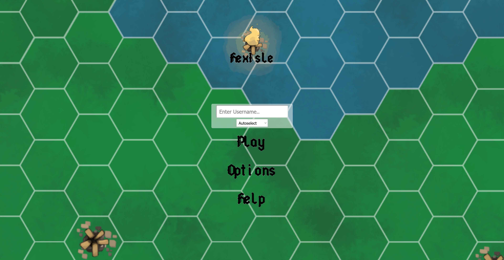
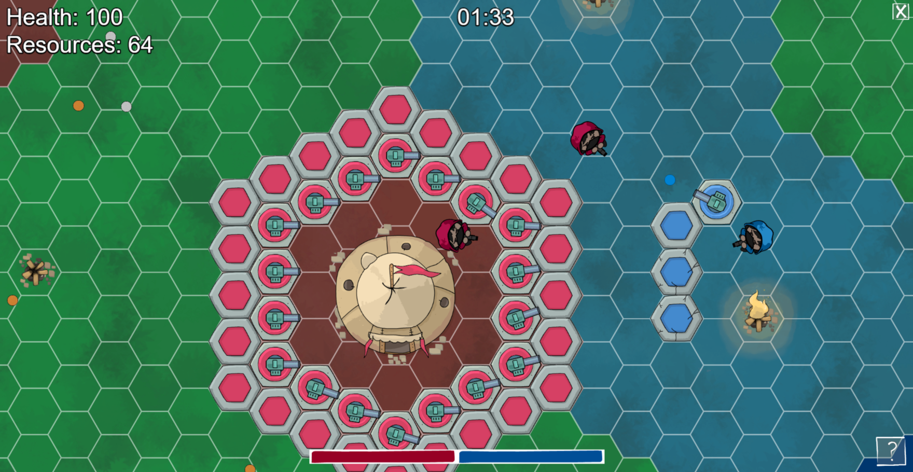

<p align="center">
    
</p>
<p align="center">
    
    <a href="https://github.com/o-chib/hexisle.io/wiki">
        
    </a>
    <a href="https://docs.google.com/document/d/1YHrR4WNBf9_-gPamyvvTtFYI9yxm49cz7WaIZMAzbWY/edit?usp=sharing">
        
    </a>
    <a href="https://github.com/o-chib/hexisle.io/blob/main/LICENSE">
        
    </a>
</p>

> Hexisle.io is a browser-enabled multiplayer arena match game where players are divided into teams and have to defend their base from being destroyed. This game requires taking risks to explore your surroundings and try to take down other bases, while simultaneously testing your skills at dodging the bullet hell other players will unleash when they see you.

## Installation 

Install HexIsle.io with npm

```bash 
  git clone https://github.com/o-chib/hexisle.io/
  cd hexisle.io
  npm install
```

This installs all the package dependencies on your local system.
    
## Deployment

By default this project runs on `port 80` so it needs evelated privellages. 

If you are working on a local or windows environment as admin, run

```bash
  npm run website
```

If you are working with `sudo` permissions, run

```bash
  npm run sudowebsite
```

#### To run without elevated privellages:
 
 You will need to edit `src\server\server.ts` line `const port = process.env.PORT || 80;` to change to another port like 3000.
 
 Then, run
 
```bash
  npm run website
```

## Running Tests

To run tests, run the following command

```bash
  npm test
```

## Screenshots





  
## Demo

[We'll put our trailer here]

  
## Tech Stack

**Frameworks:** Bootstrap (landing page), Phaser 3 (game engine)

**Tools/Languages:** Typescript

**Dependencies:** NodeJS, Express, Socket.io, Webpack, Phaser, Typescript
  
## FAQ

#### How do I access the game?

The main webpage that showcases the game is hexisle.io. At the top-right of the webpage, check the status of the game server by looking at the color of the ping icon within the Play Now button. If it is green, clicking on the button will take you to play.hexisle.io which is where the active game is being run. If it is red, the game is offline and cannot be accessed.

#### The game runs unbearably slow.

Game lag can be induced by a number of factors - server speed, network speed, server load (number of active players), game map size, etc. If lag is determined to be client-side (browser is taking a long time to render the game); try enabling Hardware Acceleration. 
If the lag is server-side, consider lowering the number of concurrent games, decreasing the size of the game map, or upgrading server specs.

#### Some of the Text on screen is pushed lower and/or I cannot see some of the UI properly.

This is typically caused by certain ad-blockers. The Brave browser’s in-built Shields ad-blocker and the DuckDuckGo extension have been known to cause this issue. Disabling the blocker that allowed the text UI to display properly.
  
## Authors

- [@Ajay925](https://github.com/Ajay925)
- [@adunn27](https://github.com/adunn27)
- [@kargupta28](https://github.com/kargupta28)
- [@o-chib](https://github.com/o-chib)

## Contributing

Contributions are always welcome!

If you'd like to contribute, please fork the repository and use a feature branch. Pull requests are also welcome.

Please adhere to this project's `MIT` license.

## Documentation

[Github Wiki](https://github.com/o-chib/hexisle.io/wiki)

[User Guide](https://docs.google.com/document/d/1YHrR4WNBf9_-gPamyvvTtFYI9yxm49cz7WaIZMAzbWY/edit?usp=sharing)

## License

Copyright © 2021 [Ajay Bhungal](https://github.com/Ajay925), [Alex Dunn](https://github.com/adunn27), [Karan Gupta](https://github.com/kargupta28), [Oorjit Chib](https://github.com/o-chib).<br />
This project is [MIT](https://github.com/o-chib/hexisle.io/blob/main/LICENSE) licensed.
  
## Feedback

If you have any feedback, please reach out to us using [issues page](https://github.com/o-chib/hexisle.io/issues).
